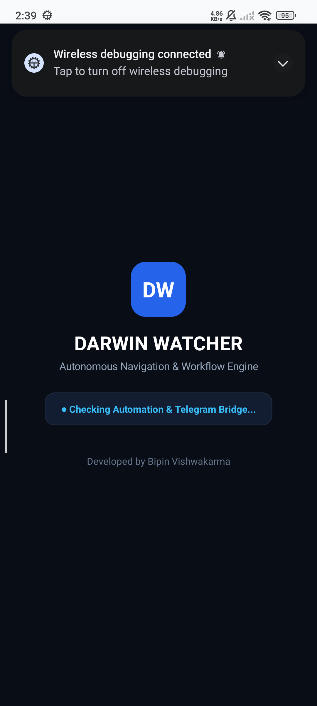
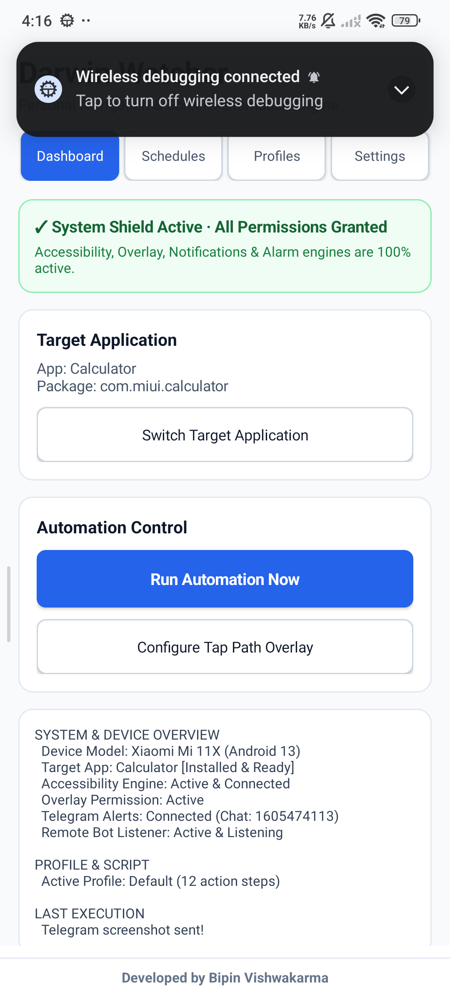
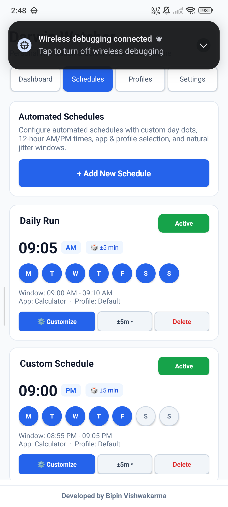
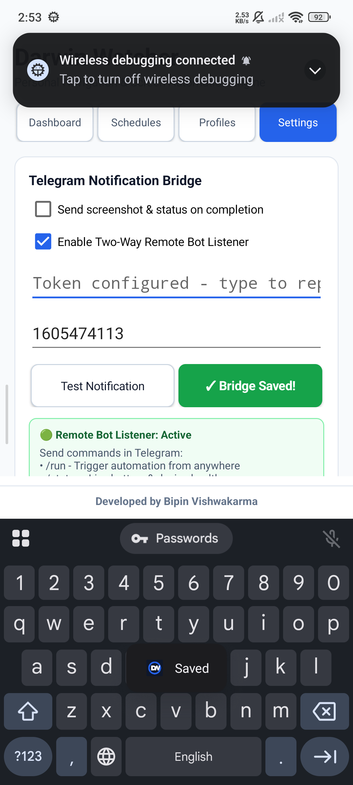

# Darwin Watcher 🤖📱

<p align="center">
  
  <br>
  <b>Autonomous Android Touch Automation, Intelligent Task Scheduler & Two-Way Telegram Remote Control</b>
</p>

<p align="center">
  
  
  
  
</p>

---

## 📌 Overview

**Darwin Watcher** is an on-device personal automation engine for Android. It enables automated touch navigation, background screen wake-up, keyguard swipe-unlocking, multi-schedule automation with natural human-like jitter, and a **Two-Way Telegram Remote Bot** that requires **zero external servers or VPS**.

---

## 📸 Interface & Live Screenshots

<p align="center">
  
  
  
</p>

<p align="center">
  <em>Figure 1: Dashboard with System Shield · Figure 2: Schedules with Day Dots & Tolerance · Figure 3: Telegram Bridge & Keep-Alive</em>
</p>

<br>

<p align="center">
  
  &nbsp;&nbsp;&nbsp;&nbsp;
  
</p>

<p align="center">
  <em>Figure 4: Interactive Schedule Editor · Figure 5: Live Execution with Clean Auto-Sleep</em>
</p>

---

## ✨ Core Features & Capabilities

### 1. 🤖 Two-Way Telegram Remote Control (No VPS Required)
- Runs a lightweight, battery-optimized foreground listener on the device.
- Send commands from Telegram anywhere in the world:
  - **`/run`**: Wakes phone, auto-swipes through lockscreen, opens target app fresh, warms up for 4s, executes taps, captures screenshot, delivers result to Telegram, and locks phone back to sleep!
  - **`/sleep`** or **`/lock`**: Remotely puts the device to sleep and locks the screen.
  - **`/status`**: Live battery %, charging state, target app, active profile, and system engine health.
  - **`/schedules`**: Lists all active daily schedules with tolerance windows.
  - **`/screenshot`**: Takes a live clean screen photo and sends it to Telegram.
  - **`/ping`**: Checks bot connectivity and returns device model (*e.g., Xiaomi Mi 11X*).

### 2. ⏰ Flexible Scheduling Engine
- **7-Day Selector**: Interactive weekday dots (`Mon` to `Sun`) with quick presets (*Weekdays*, *Every Day*, *Weekends*).
- **12-Hour AM/PM Format**: Clean time pickers with exact alarm dispatching.
- **Natural Time Tolerance Adjuster**: Customize random jitter ($\pm 0\text{m}$, $\pm 2\text{m}$, $\pm 5\text{m}$, $\pm 10\text{m}$, $\pm 15\text{m}$, $\pm 30\text{m}$) for human-like execution windows.
- **Per-Schedule Binding**: Assign specific target apps and profiles to each schedule.
- **Boot Persistence**: Automatically re-registers exact alarms upon phone reboot.

### 3. 🛡️ Locked Phone Safety & Cold-Start Reliability
- **Lock Screen Protection**: Keyguard status checks guarantee zero phantom taps on lock screens.
- **Auto Screen Wake & Swipe Unlock**: Wakes display and dispatches calibrated swipe gesture to unlock.
- **Fresh Cold Starts**: Relaunches target apps fresh from the beginning with `FLAG_ACTIVITY_CLEAR_TASK`.
- **4-Second Warmup Buffer**: Displays a live Dynamic Island countdown (`App ready · Resting (4s)...`) to allow splash screens, network requests, and layouts to settle.
- **Auto-Sleep on Completion**: Closes the target app and locks the device after sending the screenshot.

### 4. ⚡ MIUI / Xiaomi 24/7 Keep-Alive Shield
- Upgraded accessibility flags (`canRetrieveWindowContent="true"`, `FLAG_RETRIEVE_INTERACTIVE_WINDOWS`) so Android/MIUI never drops connection.
- 1-tap in-app shortcuts in **Settings** to configure:
  1. **Auto-Start**: Set to Allowed/ON
  2. **Battery Saver**: Set to No Restrictions
  3. **Recent Apps**: Lock with Padlock 🔒

---

## 🛠️ Quickstart: Build & Install

### Prerequisites
- Android SDK (`build-tools`, `platforms;android-33`)
- PowerShell (Windows) or ADB

### 1. Build the APK
```powershell
# Build debug APK with zero Gradle overhead
powershell -ExecutionPolicy Bypass -File .\build.ps1
```

### 2. Install on Device via ADB
```powershell
adb install -r .\build\darwin-watcher-debug.apk
```

---

## ⚙️ Telegram Bot Setup

1. Message **`@BotFather`** on Telegram to create your bot and copy your `BOT_TOKEN`.
2. Get your `CHAT_ID` (using `@userinfobot` or similar).
3. Open **Darwin Watcher** $\to$ Navigate to the **Settings** tab:
   - Turn **ON** `Send screenshot & status on completion`
   - Turn **ON** `Enable Two-Way Remote Bot Listener`
   - Paste your `Bot Token` and `Chat ID`
   - Tap **Save Bridge**
4. Send `/ping` or `/run` in your Telegram chat to test!

---

## 📂 Project Architecture

```text
.
├── app/src/main/
│   ├── java/com/darwin/watcher/
│   │   ├── MainActivity.java                # Multi-tab Dashboard, Schedules & Settings UI
│   │   ├── WatcherAccessibilityService.java # Accessibility touch engine, lock/unlock & screenshot
│   │   ├── Runner.java                      # Action execution loop, warmup countdown & auto-sleep
│   │   ├── TelegramRemoteService.java       # Two-way foreground bot poller & command dispatcher
│   │   ├── TelegramNotifier.java            # Multi-part Telegram Bot HTTP client (photo/text)
│   │   ├── WakeUnlockActivity.java          # Keyguard dismissal & screen turn-on activity
│   │   ├── AlarmReceiver.java               # Exact alarm scheduler with reboot resilience
│   │   ├── Prefs.java                       # Persistent schedules, profiles & configuration
│   │   └── DeviceUtils.java                 # Hardware model & system inspector
│   ├── res/                                 # Strings, styles, drawables & accessibility config
│   └── AndroidManifest.xml                  # App permissions & system services
├── assets/                                  # UI Screenshots and documentation media
├── build/                                   # Compiled ready-to-use APK
├── build.ps1                                # Native build & packaging pipeline
├── LICENSE                                  # MIT License
└── README.md                                # Project documentation
```

---

## 👨‍💻 Author

**Bipin Vishwakarma**
- GitHub: [@bipin-vishwakarma](https://github.com/bipin-vishwakarma)
